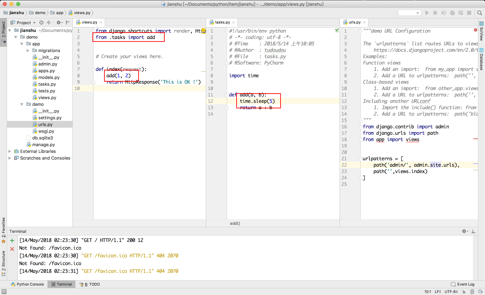
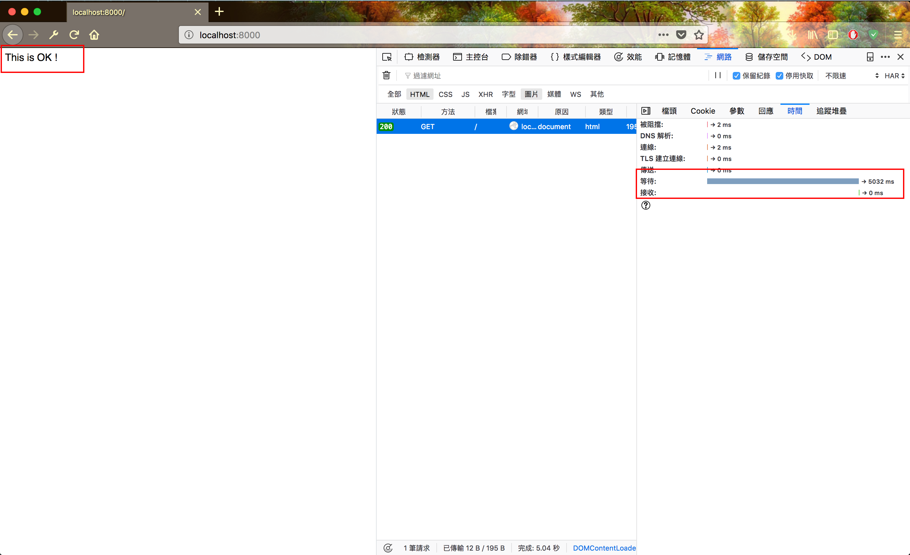
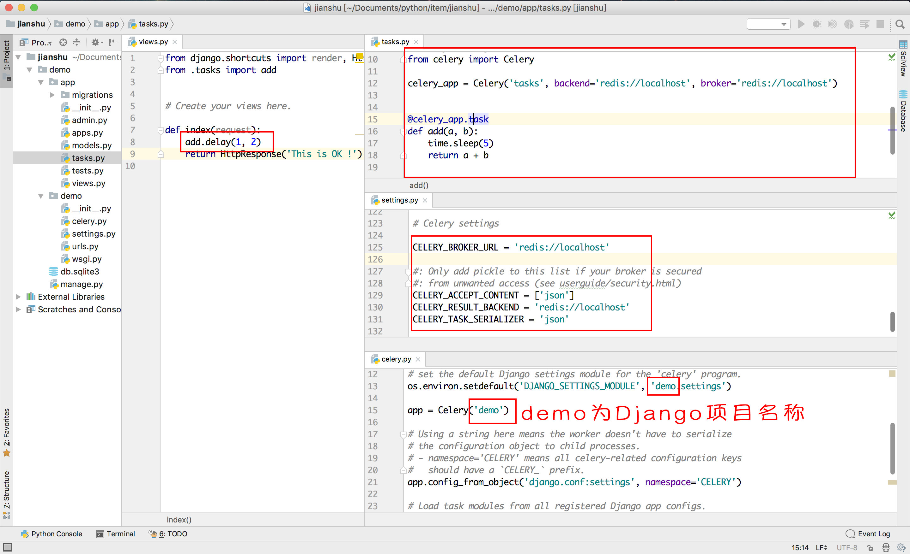
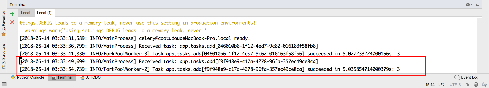

# 听说 Django 与 celery 配合更美味


**注：本文使用的开发环境如下，如不同系统或环境之间可能存在差异，本文不做其它说明**

> 操作系统 : MacOS 10.13.4
>
> Python版本 : Python 3.5.4
>
> Django版本 : 2.0.5
>
> celery 版本 : 4.1.0 
>
> celery后端 : Redis
>
> **特别强调 本文使用的是原生的 celery，因为celery官方已经在3.x版本之后将 django-celery 兼容于 celery，不再使用 django-celery **

## 0x00 前言

最近要写个Web项目，为了简便就选择使用Django作为后端开发了，突然发现程序要使用异步架构，在此原谅我废话几句说明为什么要使用异步架构，什么又是异步架构（我相信你在看这篇文章的时候已经对网络请求和回应有所了解，也应当知道Django的请求回应流程，如果不了解，那就请直接在本篇文章下面点个赞之后关闭本网页吧，因为接下来的内容已经对你目前的情况存在不适了，想看我的解释，不存在的）

言归正传，因为Django的请求回应机制，必须在执行完语句后才返回请求，但是在一些特殊的环境下，这样的操作就会带来很大的不便，比如程式在收到一个请求之后，要做很费时间的操作，用户就会出现迟迟收不到网站的响应，比如我下面的例子。呃，先放个图片镇镇场。


## 0x01 未做异步处理时的场景

部分代码如下



为了使效果更加明显，我在函数里面添加了sleep函数，模拟请求，

其实sleep函数的存在感觉就是为我这样的“流氓开发者”而存在的，不给钱就不给优化，估计增加sleep的时间，滋滋（捂脸）。别打我

这里，我们发现当请求函数里面存在费时的函数，请求就会出现延时，降低用户体验。接下来，我要开始表演啦！！！ 前方高能

## 0x02 听说 Django 与 celery 配合更美味

### 0x02-0 安装 celery

读到这里，我暂且认为您是会安装Django并且会写Django的基础语句的，如果不是，建议您点个赞之后关闭本网站，下面的内容可能会让您感到糟糕。

首先，执行安装，安装姿势详见 [First Steps with Celery](http://docs.celeryproject.org/en/latest/getting-started/first-steps-with-celery.html)，如果不想打开请直接安装下面的方式安装，但如果您想更换 celery 的后端或者安装时出现了错误，建议您优先查看此网站进行解决。

#### Mac OS X 安装

```shell
$ brew install Redis	# Redis 安装，需提前安装 brew
$ pip install celery	# pip 安装celery库
$ pip install redis		# pip 安装 redis库
```

如果您没有安装 brew，建议您先安装 brew 参考 [brew安装](https://brew.sh/index_zh-cn)

#### Ubuntu 安装

```shell
$ sudo apt install redis	# Redis 安装
$ pip install celery		# pip 安装celery库
$ pip install redis			# pip 安装 redis库
```

#### Linux 安装

请访问 [redis 下载](https://redis.io/download) 最新的安装包，本文使用的是在书写本文这个时间时最新的安装包，如官方发布更新，恕本文不另行通知更改。

```shell
$ wget http://download.redis.io/releases/redis-4.0.9.tar.gz
$ tar xzf redis-4.0.9.tar.gz
$ cd redis-4.0.9
$ make
# make完后 redis-4.0.9 目录下会出现编译后的redis服务程序redis-server,还有用于测试的客户端程序redis-cli,两个程序位于安装目录 src 目录下：
# 下面启动redis服务.
$ cd src
$ ./redis-server
```

#### Windows 安装 参考[菜鸟教程-Redis 安装](http://www.runoob.com/redis/redis-install.html) 

⚠️ 作者未进行尝试，所有错误请自行 Google

**下载地址：**<https://github.com/MSOpenTech/redis/releases>。

Redis 支持 32 位和 64 位。这个需要根据你系统平台的实际情况选择，这里我们下载 **Redis-x64-xxx.zip**压缩包到 C 盘，解压后，将文件夹重新命名为 **redis**。


打开一个 **cmd** 窗口 使用cd命令切换目录到 **C:\redis** 运行 **redis-server.exe redis.windows.conf** 。 

如果想方便的话，可以把 redis 的路径加到系统的环境变量里，这样就省得再输路径了，后面的那个 redis.windows.conf 可以省略，如果省略，会启用默认的。输入之后，会显示如下界面：


### 0x02-1 编写代码

部分代码截图如下



代码文件(./demo/demo/settings.py)

```python3
···

# Celery settings

CELERY_BROKER_URL = 'redis://localhost'

#: Only add pickle to this list if your broker is secured
#: from unwanted access (see userguide/security.html)
CELERY_ACCEPT_CONTENT = ['json']
CELERY_RESULT_BACKEND = 'redis://localhost'
CELERY_TASK_SERIALIZER = 'json'
```

代码文件(./demo/demo/celery.py)

```python3
from __future__ import absolute_import, unicode_literals
import os
from celery import Celery

# set the default Django settings module for the 'celery' program.
os.environ.setdefault('DJANGO_SETTINGS_MODULE', 'demo.settings')

app = Celery('demo')
# this ‘demo’ is your project name !!!

# Using a string here means the worker doesn't have to serialize
# the configuration object to child processes.
# - namespace='CELERY' means all celery-related configuration keys
#   should have a `CELERY_` prefix.
app.config_from_object('django.conf:settings', namespace='CELERY')

# Load task modules from all registered Django app configs.
app.autodiscover_tasks()
```

代码文件(./demo/app/tasks.py)

```python3
import time
from celery import Celery

celery_app = Celery('tasks', backend='redis://localhost', broker='redis://localhost')
# this is celery settings

# this is a function about need many time
@celery_app.task
def add(a, b):
    time.sleep(5)
    return a + b
```

编辑完成代码之后，开始运行web程式吧

首先，我们要启动 redis 服务，在终端执行 ` redis-server ` 启动服务，如看见类似下面这样的输出，且没有报错，则redis启动成功。

```shell
5433:C 14 May 11:24:01.463 # oO0OoO0OoO0Oo Redis is starting oO0OoO0OoO0Oo
5433:C 14 May 11:24:01.465 # Redis version=4.0.9, bits=64, commit=00000000, modified=0, pid=5433, just started
5433:C 14 May 11:24:01.465 # Warning: no config file specified, using the default config. In order to specify a config file use redis-server /path/to/redis.conf
5433:M 14 May 11:24:01.467 * Increased maximum number of open files to 10032 (it was originally set to 256).
                _._                                                  
           _.-``__ ''-._                                             
      _.-``    `.  `_.  ''-._           Redis 4.0.9 (00000000/0) 64 bit
  .-`` .-```.  ```\/    _.,_ ''-._                                   
 (    '      ,       .-`  | `,    )     Running in standalone mode
 |`-._`-...-` __...-.``-._|'` _.-'|     Port: 6379
 |    `-._   `._    /     _.-'    |     PID: 5433
  `-._    `-._  `-./  _.-'    _.-'                                   
 |`-._`-._    `-.__.-'    _.-'_.-'|                                  
 |    `-._`-._        _.-'_.-'    |           http://redis.io        
  `-._    `-._`-.__.-'_.-'    _.-'                                   
 |`-._`-._    `-.__.-'    _.-'_.-'|                                  
 |    `-._`-._        _.-'_.-'    |                                  
  `-._    `-._`-.__.-'_.-'    _.-'                                   
      `-._    `-.__.-'    _.-'                                       
          `-._        _.-'                                           
              `-.__.-'                                               

5433:M 14 May 11:24:01.470 # Server initialized
5433:M 14 May 11:24:01.470 * DB loaded from disk: 0.000 seconds
5433:M 14 May 11:24:01.470 * Ready to accept connections
^C5433:signal-handler (1526271328) Received SIGINT scheduling shutdown...
5433:M 14 May 12:15:28.345 # User requested shutdown...
5433:M 14 May 12:15:28.345 * Saving the final RDB snapshot before exiting.
5433:M 14 May 12:15:28.348 * DB saved on disk
5433:M 14 May 12:15:28.348 # Redis is now ready to exit, bye bye...
```

之后新建终端，执行命令 `python manage.py runserver` ，之后再新建一个终端，执行命令 `celery -A demo worker -l info` (注： 此处的demo为Django项目名称)，没有看到报错的话，就证明运行成功了。

再次访问网址


我们来看一下日志



在访问网址5秒之后，自定义的`add`函数运行完成，并没有阻塞我们的访问响应。

## 0x03 结语

至此，我想你应该已经初步了解如何在Django中使用celery了。

感谢您的阅读，点赞和打赏是一种美德，卖萌ヾ(≧O≦)〃嗷~